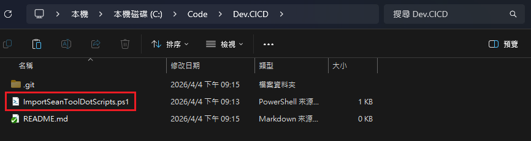
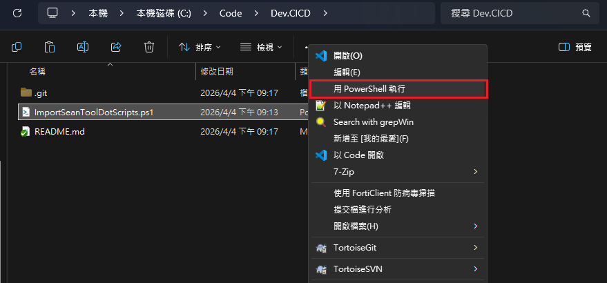
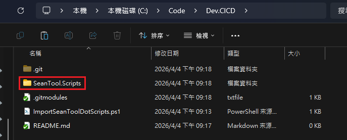
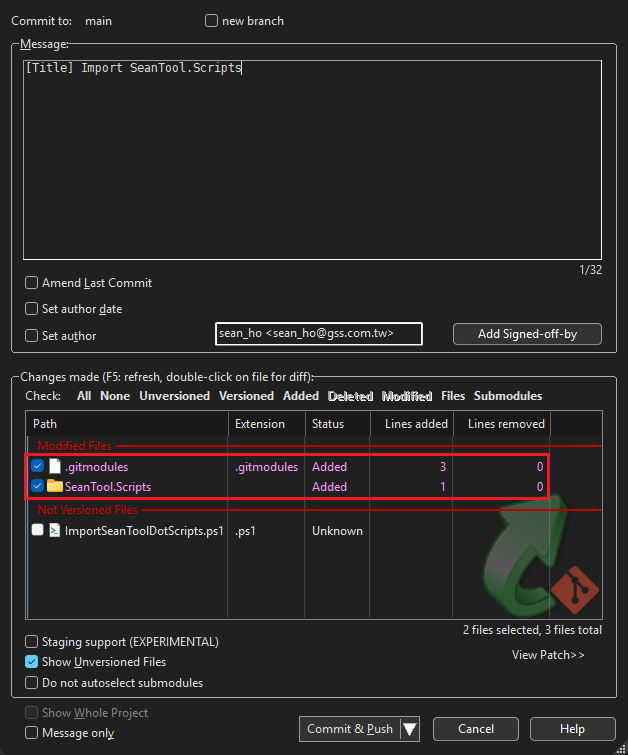

# 如何在其他專案引用此專案
1. 將 [ImportSeanToolDotScripts.ps1](../Shell/Windows/PowerShell/Git/ImportSeanToolDotScripts.ps1) 複製到你的專案中
    - 
2. 執行該腳本
    - 
    - 
3. 將 ``.gitmodules`` 與 ``SeanTool.Scripts`` 兩個檔案加入版本控制
    - 

# 重新 clone 專案 SeanTool.Scripts 是空的
1. 將 [CloneSeanToolDotScripts.ps1](../Shell/Windows/PowerShell/Git/CloneSeanToolDotScripts.ps1) 複製到你的專案中
2. 執行該腳本

# 更新專案 SeanTool.Scripts 的內容
1. 將 [UpdateSeanToolDotScripts.ps1](../Shell/Windows/PowerShell/Git/UpdateSeanToolDotScripts.ps1) 複製到你的專案中
2. 執行該腳本
3. 將 ``SeanTool.Scripts`` Link 檔案更新 git